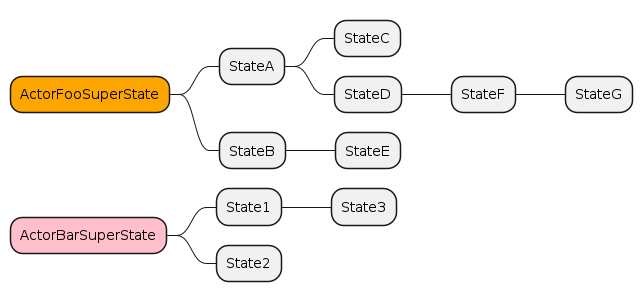
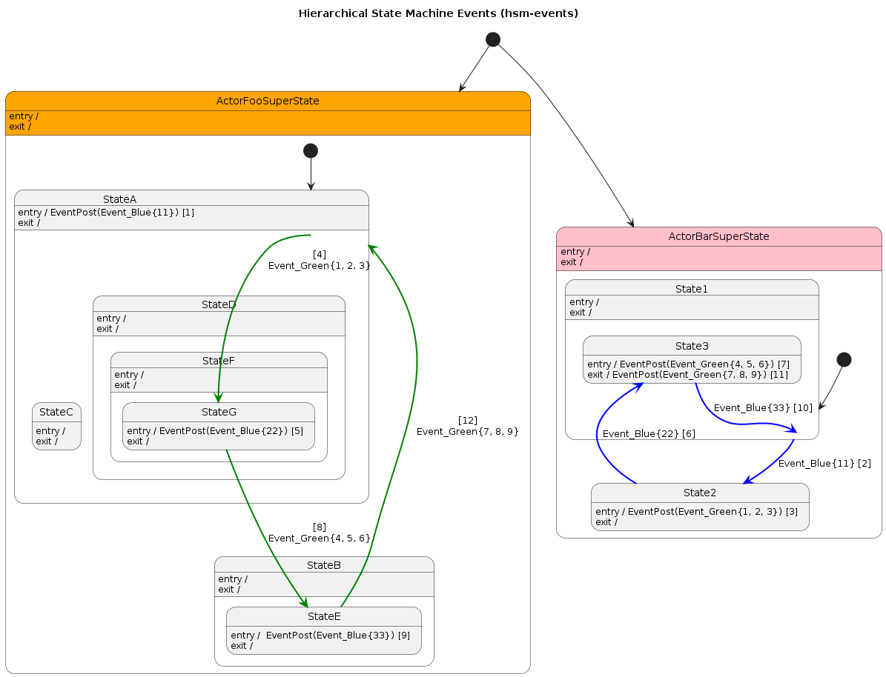
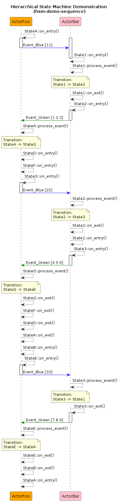

# Demonstration Documentation

- This demonstration code implements an application that defines 2 `actors`:
    - `ActorFoo`
    - `ActorBar`

- Each `actor` contains it's own event queue and thread and implements a different set of states in an hierarchical state machine (HSM)

- The following image shows that HSM of each of the 2 `actors` in a mind map, where it is possible to visualize the hierarchy relationship of the states

- The 2 `actors` communicate with each other only via 2 types of asynchronous events:
    - `EventBlue`
    - `EventGreen`

- The following image shows the state diagram of the 2 `actors`, where it is possible to visualize the entry and exit actions of each state as well as the state transitions given the reception of specific events

- The demonstration code implemented will perform the sequence of events as described in the following image:

